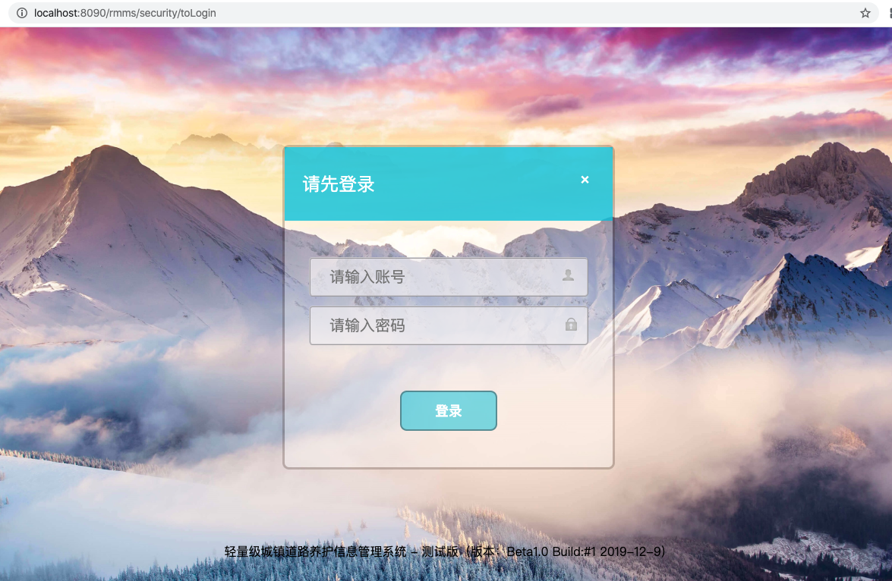
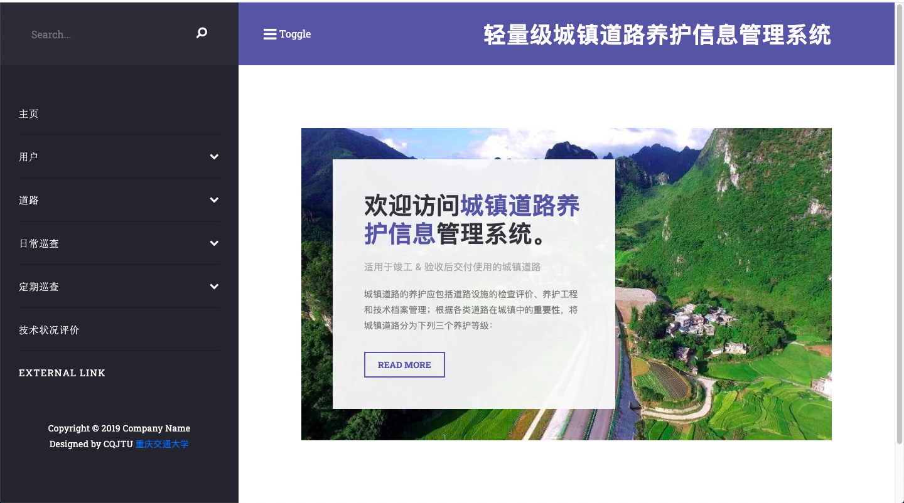
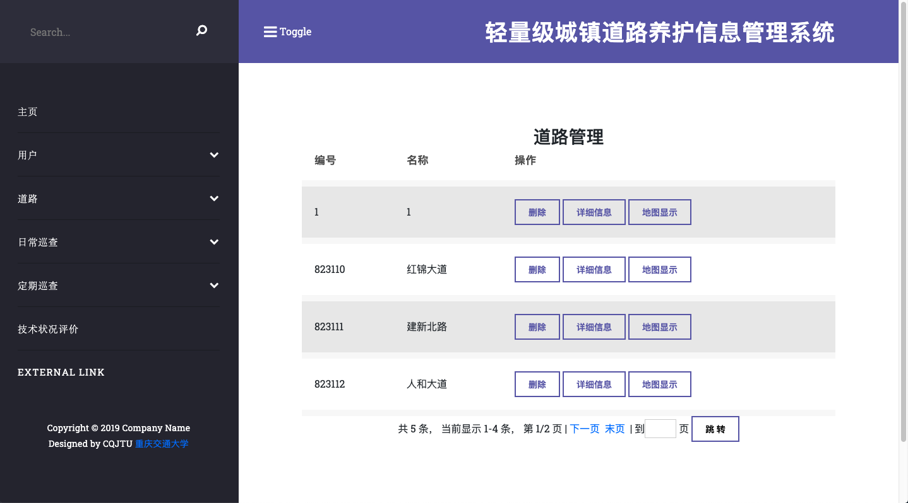
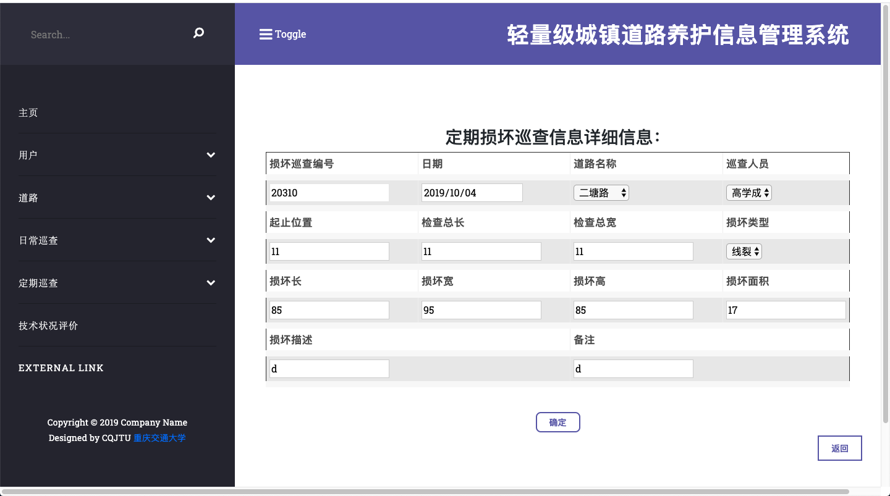
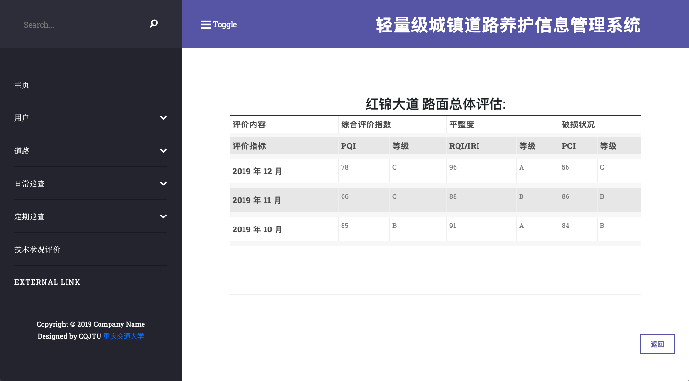

# 轻量级城镇道路养护信息管理系统

### 项目简介：

某道路管理所为保持城镇道路设施的功能，保证其完好和安全运行，提高服务水平，统一技术标准，规范养护工作，参照《城镇道路养护技术规范CJJ 36-2016》规范，提出编制一套“轻量级城镇道路养护信息管理系统”，以实现所管辖道路的养护管理信息化。本系统主要完成车行道沥青路面、水泥混凝土路面的日常巡检和定期检查，包含数据的采集、评估计算，最终生成评估结果。

#### **项目详细的需求书：[附件1](./assets/)**

#### **本项目只完成部分功能，欢迎交流学习。**

### 项目所用技术:

- SpringBoot
- 通用 Mapper 和 Mybatis
- Thymeleaf
- Bootstrap
- Mysql
- Gradle

* log4j2 和 Druid 连接池

###  使用方法

#### IntelliJ IDEA（或其他编译工具）

1. Sql 导入数据库中

2. 将项目导入到 **IntelliJ IDEA** 中，然后利用 gradle 版本控制工具导入 jar。
3. 修改项目中 */rmms/src/main/resources/application.yml 的数据库连接名及用户验证。
4. 启动主函数 App.java 即可。最后打开浏览器，输入 http://localhost:8090/rmms，即可浏览系统。

### 项目演示

*登录*

 

*主页*

 

*道路*

 

*巡查*

 

*评估*

